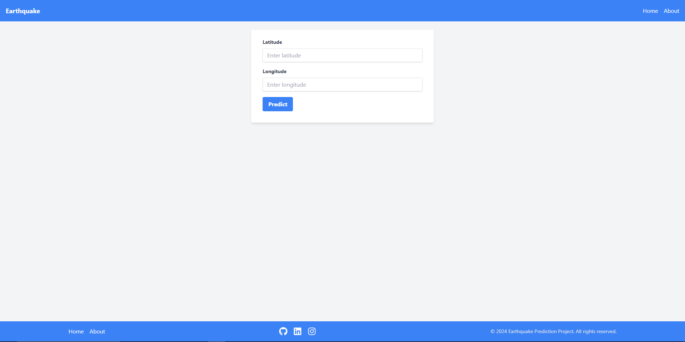
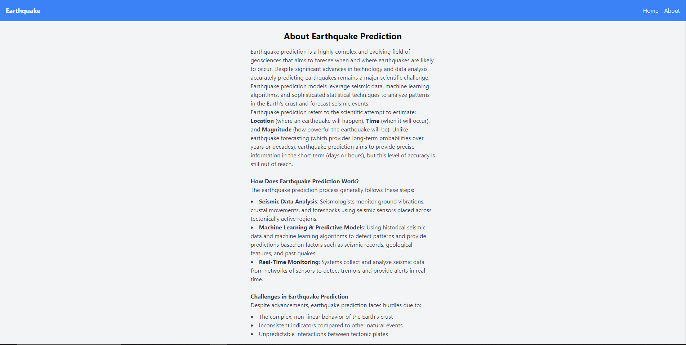
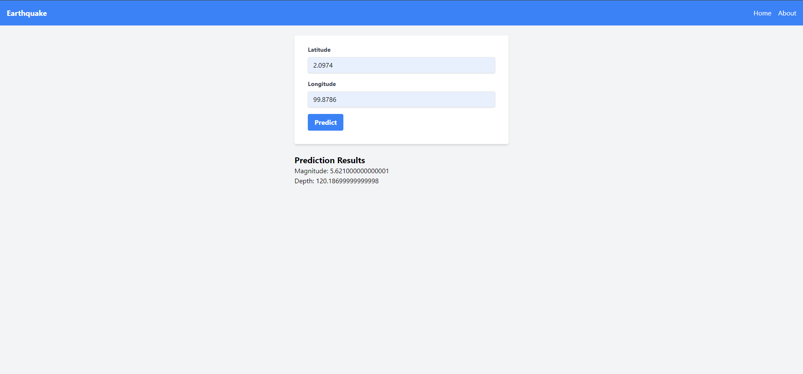

# 🌍 Earthquake Prediction Project 

This project aims to provide predictions of earthquake occurrences based on seismic data. Using Django's powerful backend framework, I have built an API that can be easily extended and used for further analysis.

## 🌍 Project Overview: Earthquake Prediction Project

This Earthquake Prediction project aims to predict the likelihood of seismic activity based on historical earthquake data and geological parameters. Using machine learning techniques, the model analyzes factors such as latitude, longitude, depth, magnitude, and other features to generate predictions.

The project includes both a backend (Django-based API) for processing and serving predictions, and a frontend (ReactJS with Tailwind CSS) for an interactive, user-friendly interface. Users can input earthquake-related parameters through the frontend, which communicates with the API to receive predictions generated by the trained model.

In addition, the project includes data visualizations that map earthquake-prone regions, allowing for better understanding and exploration of areas with frequent seismic activity. This setup provides a comprehensive tool to analyze and predict earthquakes, aiding in research and risk assessment.

## 🌍 Earthquake Prediction Model: Step-by-Step Guide

### 📚 Step 1: Importing Essential Libraries

To begin, I imported all the essential libraries for data processing, visualization, geospatial analysis, and machine learning:

```
import pandas as pd
import numpy as np
import os
import matplotlib.pyplot as plt
import seaborn as sns
from IPython.display import display
import plotly.express as px
from shapely.geometry import Point
import geopandas as gpd
from geopandas import GeoDataFrame
from sklearn.model_selection import train_test_split as tts
from sklearn import preprocessing 
from sklearn.preprocessing import StandardScaler
from sklearn.metrics import accuracy_score
from sklearn.metrics import classification_report, roc_auc_score
from sklearn.linear_model import LinearRegression as lg
from sklearn.model_selection import cross_val_score
from sklearn.metrics import mean_squared_error, mean_absolute_error
from sklearn.tree import DecisionTreeRegressor
from sklearn.svm import SVR
from sklearn.neighbors import KNeighborsRegressor
```
These libraries allowed me to:

* Process and explore the dataset with pandas and numpy.
* Visualize data patterns with matplotlib and seaborn.
* Plot earthquake locations using geopandas.
* Build and evaluate machine learning models using scikit-learn.

### 📂 Step 2: Accessing and Understanding the Dataset
The dataset contains various parameters essential for earthquake prediction, such as:

* Location (Latitude, Longitude)
* Magnitude and Depth
* Time and Date of Occurrence
* Error Margins (e.g., Depth Error, Horizontal Error)
* Magnitude Type and Source
* Each column provides critical information for understanding and predicting earthquake behavior.

### 🌎 Step 3: Geospatial Plotting of Earthquake Regions
Using geopandas, I plotted the earthquake locations on a world map. This visualization helped identify areas more prone to seismic activity and understand geographical patterns in earthquake occurrences.

```
gdf = GeoDataFrame(df, geometry=GeoDataFrame.from_xy(df['Longitude'], df['Latitude']))
world = gpd.read_file(gpd.datasets.get_path('naturalearth_lowres'))
fig, ax = plt.subplots(figsize=(10, 10))
world.plot(ax=ax, color='lightgray')
gdf.plot(ax=ax, color='red', markersize=5)
plt.title("Earthquake Locations")
plt.show()
```
### 🔤 Step 4: Label Encoding of Categorical Variables
Since some of the columns were in text format (like `Location Source`, `Magnitude Source`, and `Status`), I used LabelEncoder to transform these categorical values into numerical format, making them suitable for machine learning.

```
from sklearn import preprocessing
label_encoder = preprocessing.LabelEncoder()
df['Location Source'] = label_encoder.fit_transform(df['Location Source'])
df['Magnitude Source'] = label_encoder.fit_transform(df['Magnitude Source'])
df['Status'] = label_encoder.fit_transform(df['Status'])
```

### 🔄 Step 5: Train-Test Split
To evaluate the model's performance, I divided the dataset into training and testing sets:

With this setup:

* 80% of the data was used for training.
* 20% was kept for testing to evaluate model accuracy

### 🤖 Step 6: Model Selection and Training
I tested several machine learning models to find the one that would perform best for earthquake prediction, including:

* Linear Regression
* Decision Trees
* Random Forest Regressor
  
After comparing the models, I found that the Random Forest Regressor performed best for this task.

### 🔍 Why Random Forest Regressor?
The Random Forest Regressor is an ensemble learning method that:

* Combines multiple decision trees to improve predictive accuracy.
* Reduces overfitting by averaging multiple trees’ predictions, leading to more generalized and reliable performance.
* Handles nonlinear relationships well, which is essential in earthquake data, where relationships between factors like depth, location, and magnitude are complex.
```
from sklearn.ensemble import RandomForestRegressor

model = RandomForestRegressor(n_estimators=100, random_state=42)
model.fit(X_train, y_train)

```
####💾 Step 7: Saving the Model
Finally, I saved the trained Random Forest model using joblib, allowing it to be loaded and used in a Django API.
```
import joblib
joblib.dump(model, 'earthquake_model.pkl')
```

## 🌐 Created the Frontend with ReactJS and Tailwind CSS for Client-Side UI
To make the project accessible and user-friendly, I created a frontend using ReactJS and Tailwind CSS. This client-side interface allows users to input parameters and receive earthquake predictions in a visually appealing and responsive UI.

🔸 Key Features of the Frontend:
* Simple Input Form: Users can enter earthquake parameters (latitude, longitude, magnitude, depth, etc.) to receive predictions.
* Tailwind CSS Styling: Enhanced the UI with a clean, minimalist design using Tailwind CSS for custom styling and responsive design.

## 📸 Screenshots of the Project








## 🛠️ Step 1: Setting Up the Django Project

### 🌱 Prerequisites
- Python 3.x 🐍
- Django 🌐
- Django REST Framework (DRF) 🚀
- Pandas, NumPy, and Scikit-learn (for model training and processing) 📊

## 🛠️ Step 1: Setting Up the Django Project
1. Initialize the Django Project:
```
django-admin startproject earthquake
cd earthquake
```
2. Create a Django App: Inside the project folder, we created a new app to handle earthquake data and prediction logic:
```
python manage.py startapp prediction
```

3. Install Django REST Framework: Added DRF to handle API views and serialization.
```
pip install djangorestframework
```

4. Update settings.py: In settings.py, we added 'rest_framework' and our app 'prediction' to INSTALLED_APPS:
```
INSTALLED_APPS = [
    ...,
    'rest_framework',
    'prediction',
]
```

### 🗃️ Step 2: Creating the Model for Earthquake Data
Define the Earthquake Model 🌍: We created a model to store earthquake-related data, which includes fields like date, location, magnitude, and depth.

### 🔗 Step 3: Serializing the Model
To convert model instances into JSON data, we created a serializer in serializers.py:

### 🚀 Step 4: Building Views for API Endpoints
Define the Views: We created views for fetching earthquake data and predictions. Django REST Framework's viewsets helped us manage CRUD operations efficiently.

### 🌐 Step 5: Setting Up URLs
In urls.py, we configured routes for the API endpoints.

### ⚡ Step 6: Testing the API
Run the Django Development Server:

Example requests:

* `GET /earthquakes/`: Fetch all earthquake records
* `POST /earthquakes/`: Add a new earthquake record
  
### 📈 Future Enhancements
Machine Learning Model Integration: Implement a machine learning model to predict earthquake probability based on location and seismic history.

Improved Error Handling: Provide custom error messages and validations for API responses.


## 🌍 How to Use the Earthquake Prediction Project
### Step 1: Set Up the Project Repository
1. Clone the Repository:

* Clone the project repository from GitHub (link will be provided if available).
```
git clone <repository_link>
cd earthquake-prediction-project
```

2. Install Dependencies:

* Make sure to install all necessary packages for both the backend and frontend.

### Step 2: Backend Setup (Django + Machine Learning API)
1. Set Up Virtual Environment:

* Create and activate a virtual environment to keep your dependencies isolated.
```
python -m venv env
source env/bin/activate  # On Windows: env\Scripts\activate
```

2. Install Python Dependencies:

* Install the required Python packages listed in the requirements.txt file.
```
pip install -r requirements.txt
```

3. Load the Pretrained Model:

* Make sure the earthquake_model.joblib file (saved Random Forest model) is in the appropriate directory.
* The Django API will use this model to make predictions based on user inputs.
  
4. Run Django Migrations:

* Set up the database by running migrations.
```
python manage.py migrate
```

5. Start the Django Server:

* Run the server to activate the API.
```
python manage.py runserver
```
The API will be accessible at `http://127.0.0.1:8000`.

### Step 3: Frontend Setup (ReactJS + Tailwind CSS)

1.  Navigate to the Frontend Directory:
  
* Move to the React frontend directory.
```
cd earthquake-prediction-frontend
```

2. Install Frontend Dependencies:

* Install the required Node.js packages.
```
npm install
```
3. Start the Frontend Server:

* Run the React development server.
```
npm start
```

The frontend will open in your browser, typically at `http://localhost:3000`.

### Step 4: Using the Application
* Navigate to the Input Form:
* Open the frontend interface. You’ll see an input form where you can enter earthquake parameters (latitude, longitude, magnitude, depth, etc.).
* Submit Data for Prediction
* Fill in the form with earthquake-related parameters and submit the data.
* The frontend will send this data to the backend API, which uses the trained model to generate a prediction.
* View Prediction Results:


## 🚀 What I Learned from This Project

Working on this Earthquake Prediction project taught me valuable lessons in both machine learning and full-stack development:

1. Understanding of Machine Learning Models:

* I gained insights into various machine learning models and learned how each model differs in its approach to handling data and predicting outcomes.
* Experimenting with different models helped me appreciate why Random Forest was suitable for this type of complex, nonlinear dataset.
  
2. API Development for Machine Learning Models:

* Building the API in Django taught me how to serve machine learning models as APIs, allowing predictions to be accessible via a web interface.

3. Challenges with Model Deployment:

* Due to the large size of the joblib model file, I couldn’t upload it to GitHub, and my GitHub LFS (Large File Storage) is full. I plan to revisit this deployment challenge and find a solution to host the model in the future.
  
This project was a comprehensive learning experience, covering everything from data preprocessing and model training to building a user-friendly frontend and deploying an API. I look forward to continuing to enhance this project by solving deployment challenges and adding more functionality! 🌟


## 👩‍💻 How to Contribute

Feel free to submit pull requests or open issues for any bugs or feature suggestions!


